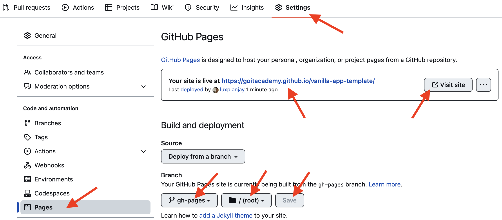

# Vanilla App Template

Цей проект було створено за допомогою Vite. Для знайомства та налаштування
додаткових можливостей [звернись до документації](https://vitejs.dev/).

## Створення репозиторію за шаблоном

Використовуй цей репозиторій організації GoIT як шаблон для створення
репозиторію свого проекту. Для цього натисни на кнопку `«Use this template»` і
обери опцію `«Create a new repository»`, як показано на зображенні.


На наступному етапі відкриється сторінка створення нового репозиторію. Заповни
поле його імені, переконайся, що репозиторій публічний, після чого натисни
кнопку `«Create repository from template»`.


Після того, як репозиторій буде створено, необхідно перейти в налаштування
створеного репозиторію на вкладку `Settings` > `Actions` > `General` як показано
на зображенні.


Проскроливши сторінку до самого кінця, в секції `«Workflow permissions»` обери
опцію `«Read and write permissions»` і постав галочку в чекбоксі. Це необхідно
для автоматизації процесу деплою проекту.


Тепер у тебе є особистий репозиторій проекту, зі структурою файлів та папок
репозиторію-шаблону. Далі працюй з ним, як з будь-яким іншим особистим
репозиторієм, клонуй його собі на комп'ютер, пиши код, роби коміти та відправляй
їх на GitHub.

## Підготовка до роботи

1. Переконайся, що на комп'ютері встановлено LTS-версію Node.js.
   [Скачай та встанови](https://nodejs.org/en/) її якщо необхідно.
2. Встанови базові залежності проекту в терміналі командою `npm install`.
3. Запусти режим розробки, виконавши в терміналі команду `npm run dev`.
4. Перейдіть у браузері за адресою
   [http://localhost:5173](http://localhost:5173). Ця сторінка буде автоматично
   перезавантажуватись після збереження змін у файли проекту.

## Файли і папки

- Файли розмітки компонентів сторінки повинні лежати в папці `src/partials` та
  імпортуватись до файлу `index.html`. Наприклад, файл з розміткою хедера
  `header.html` створюємо у папці `partials` та імпортуємо в `index.html`.
- Файли стилів повинні лежати в папці `src/css` та імпортуватись до HTML-файлів
  сторінок. Наприклад, для `index.html` файл стилів називається `index.css`.
- Зображення додавай до папки `src/img`. Збирач оптимізує їх, але тільки при
  деплої продакшн версії проекту. Все це відбувається у хмарі, щоб не
  навантажувати твій комп'ютер, тому що на слабких компʼютерах це може зайняти
  багато часу.

## Деплой

Продакшн версія проекту буде автоматично збиратися та деплоїтись на GitHub
Pages, у гілку `gh-pages`, щоразу, коли оновлюється гілка `main`. Наприклад,
після прямого пуша або прийнятого пул-реквесту. Для цього необхідно у файлі
`package.json` змінити значення прапора `--base=/<REPO>/`, для команди `build`,
замінивши `<REPO>` на назву свого репозиторію, та відправити зміни на GitHub.

```json
"build": "vite build --base=/<REPO>/",
```

Далі необхідно зайти в налаштування GitHub-репозиторію (`Settings` > `Pages`) та
виставити роздачу продакшн версії файлів з папки `/root` гілки `gh-pages`, якщо
це не було зроблено автоматично.



### Статус деплою

Статус деплою крайнього коміту відображається іконкою біля його ідентифікатора.

- **Жовтий колір** - виконується збірка та деплой проекту.
- **Зелений колір** - деплой завершився успішно.
- **Червоний колір** - під час лінтингу, збірки чи деплою сталася помилка.

Більш детальну інформацію про статус можна переглянути натиснувши на іконку, і в
вікні, що випадає, перейти за посиланням `Details`.


### Жива сторінка

Через якийсь час, зазвичай кілька хвилин, живу сторінку можна буде подивитися за
адресою, вказаною на вкладці `Settings` > `Pages` в налаштуваннях репозиторію.
Наприклад, ось посилання на живу версію для цього репозиторію

[https://goitacademy.github.io/vanilla-app-template/](https://goitacademy.github.io/vanilla-app-template/).

Якщо відкриється порожня сторінка, переконайся, що у вкладці `Console` немає
помилок пов'язаних з неправильними шляхами до CSS та JS файлів проекту
(**404**). Швидше за все у тебе неправильне значення прапора `--base` для
команди `build` у файлі `package.json`.

## Як це працює


1. Після кожного пуша у гілку `main` GitHub-репозиторію, запускається
   спеціальний скрипт (GitHub Action) із файлу `.github/workflows/deploy.yml`.
2. Усі файли репозиторію копіюються на сервер, де проект ініціалізується та
   проходить лінтинг та збірку перед деплоєм.
3. Якщо всі кроки пройшли успішно, зібрана продакшн версія файлів проекту
   відправляється у гілку `gh-pages`. В іншому випадку, у лозі виконання скрипта
   буде вказано в чому проблема.

   ТЗ
Завдання: Реалізація інтернет магазину.


Ви маєте командою створити інтернет магазин по описаному технічному завданню.


API ендпоінти:

https://dummyjson.com/docs/products - документація бекенду, розділ продукти
https://dummyjson.com/products?limit=10&skip=10 - отримати всі продукти з пагінацією
https://dummyjson.com/products/1 - отримати один продукт по ID
https://dummyjson.com/products/search?q=nail - пошук продукту по ключовому слову
https://dummyjson.com/products/category-list - отримати список категорій продуктів
https://dummyjson.com/products/category/smartphones - отримати продукти по категорії


Підготовка до роботи:

Один учасник команди (тімлід) створює новий командний репозиторій за цим шаблоном;
Додає всіх учасників (collaborators), які будуть працювати над проєктом
Додатково налаштовує репозиторій - захищає гілку main від прямих пушів, налаштовує автоматичне видалення гілок після merge, налаштовує репозиторій по інструкції у файлі readme.md, щоб робота працювала на живій сторінці Гітхаба.
Всі учасники команди клонують репозиторій на свій ПК/ноутбук
Встановлюють залежності через npm i;
Запускають бандлер командою npm run dev
Знайомляться зі структурою файлів у проєкті


Стартові файли:

В шаблоні репозиторію вже є створені html, js та css файли, потрібні для виконання завдання. При додаванні додаткового функціоналу за потреби можна додавати потрібні файли. Перед виконанням проєкту ознайомтесь з вмістом цих файлів.

CSS - в папці css знаходяться потрібні файли для стилізації окремих частин інтерфейсу. По назвам файлів буде зрозуміло, яка частина інтерфейсу в них стилізована.
HTML - буде 3 окремі сторінки - Home, Wishlist, Cart плюс додаткові паршали, які будуть перевикористовуватись.


Для організації JS використовується модульність та синтаксис export/import:

У файлі home.js логіка сторінки Home (index.html)
У файлі wishlist.js логіка сторінки Wishlist (wishlist.html)
У файлі cart.js логіка сторінки Cart (cart.html)
У файлі products-api.js зберігай функції для запитів на бекенд.
У файлі render-functions.js зберігай функції для відображення елементів інтерфейсу.
У файлі storage.js зберігай функції для роботи з localStorage.
У файлі handlers.js зберігай хендлери, які передаються в addEventListener.
У файлі modal.js зберігай функції модального вікна (відкриття, закриття і так далі).
У файлі helpers.js зберігай допоміжні функції, які знадобляться для реалізації завдання
У файлі refs.js зберігай обʼєкт refs з посиланнями на елементи ДОМ.
У файлі constants.js зберігай константи, які будуть використовуватись в роботі.


Опис функціоналу:

При завантаженні основної сторінки в списку ul.categories рендериться список категорій продуктів, отриманих з бекенду. В списку ul.products рендериться список продуктів, отриманих з бекенда (з пагінацією 12 товарів). Після списку продуктів зʼявляється кнопка loadMore для завантаження наступної порції продуктів. Якщо на бекенді не залишилось продуктів, кнопка loadMore приховується і зʼявляється повідомлення. Для повідомлень використовуємо бібліотеку iziToast.


При кліку по кнопці з категорією іде запит на бекенд за товарами по обраній категорії, пагінація 12 товарів на сторінку. Обрана категорія виділяється активною.


При кліку в картку продукту виконується запит на бекенд за цим продуктом по ID, відкривається модальне вікно і продукт рендериться у модальному вікні. Також в модальному вікні рендеряться кнопки Add to Wishlist та Add to Cart. Модальне вікно має закриватись по кліку в кнопку закриття, по кліку в бекдроп і при натисканні на кнопку ESC. Слухач клавіатури для закриття модального вікна має ставитись при відкритті модального вікна і зніматись при закритті.


При кліку в кнопки Add to Wishlist та Add to Cart продукт додається до Wishlist або Card відповідно і зберігається в localStorage. Кнопки міняють текстовий контент на Remove from Wishlist та Remove from Cart. В навігації відображається кількість доданих продуктів до Wishlist та Card. При відкритті модального вікна потрібно перевіряти наявність продукту в wishlist та cart і при наявності продукт змінювати текстовий контент кнопки на Remove from Wishlist та Remove from Cart відповідно.


При переході на сторінку Wishlist рендеряться продукти додані у wishlist. Потрібно додати функціонал відкриття продукту в модальному вікні та видалення з wishlist.


При переході на сторінку Cart відмальовуються продукти, які були додані у Cart, а також загальна інформація - кількість товарів у кошику, загальна вартість та кнопка оплати.


Функціональні вимоги

Робота з товарами:

1. При завантаженні сторінки Home отримай категорії товарів з API:

 Зроби запит на ендпоінт №5, отримай масив категорій. На початок отриманого масиву додай рядок “All” і відрендери категорії в списку ul.categories . Шаблон категорії:
<li class="categories__item">
   <button class="categories__btn" type="button"></button>
 </li>

Стилізація списку категорій вже є в шаблоні репозиторію.


2. При завантаженні сторінки Home отримай товари з API:

Зроби запит на ендпоінт №2 та отримай масив обʼєктів товарів, де skip = (поточна сторінка - 1) * 12. Приклад: для сторінки 2 → skip=12, для сторінки 3 → skip=24.
const currentPage = 1;
const url = `https://dummyjson.com/products?limit=12&skip=${(currentPage - 1) * 12}`;

Відобрази товари на сторінці Home (пагінація: 12 товарів на сторінку).
 Використай HTML-шаблон товару для створення розмітки списку товарів і метод map() для перебору масиву товарів, який приходить з бекенду. Доповни шаблон необхідними даними і встав розмітку в ul.products.

<li class="products__item" data-id="">
    
    <p class="products__title"></p>
    <p class="products__brand"><span class="products__brand--bold">Brand:</span></p>
    <p class="products__category">Category: </p>
    <p class="products__price">Price: $</p>
 </li>


3. Реалізуй делегування на списку ul.categories

при кліку в обрану категорію потрібно прочитати текстовий контент кнопки і зробити запит по ендпоінту №6 підставивши в url прочитану категорію.
отриманий масив обʼєктів продуктів потрібно відрендерити в списку ul.products з пагінацією 12 продуктів на сторінку
до кнопки обраної категорії потрібно додати клас categories__btn--active , щоб стилізувати її активною.
клік по категорії ALL робить запит на бекенд по ендпоінту №2 і в списку ul.categories рендеряться продукти без фільтрації по категоріям. Пагінація 12
якщо відсутні продукти по обраній категорії, потрібно відобразити повідомлення, що продуктів не знайдено. Для цього до div.not-found потрібно додати клас not-found--visible


4. Реалізуй делегування на списку ul.products

при кліку в картку продукту потрібно прочитати попередньо записаний ID на тезі li
зробити запит по ендпоінту №3, відкрити модальне вікно і відрендерити в div.modal-product отриманий продукт.
шаблон продукту

      <div class="modal-product__content">
        <p class="modal-product__title"></p>
        <ul class="modal-product__tags"></ul>
        <p class="modal-product__description"></p>
        <p class="modal-product__shipping-information">Shipping:</p>
        <p class="modal-product__return-policy">Return Policy:</p>
        <p class="modal-product__price">Price: $</p>
        <button class="modal-product__buy-btn" type="button">Buy</button>
      </div>

модальне вікно відкривається додавання до div.modal класу modal--is-open і закривається зняттям цього класу з div.modal


5. Пошук товарів за назвою.

при сабміті форми в хедері (form.search-form) зроби запит на бекенд по ендпоінту №4 підставивши value інпута в url.
отриманий масив продуктів відрендери в ul.products з пагінацією 12.
якщо відсутні продукти по пошуковому слову ul.products очищається і показується відповідне повідомлення
не повинні іти на бекенд запити з порожнім рядком та пробілами
клік в кнопку button.search-form__btn-clear , яка зʼявляється, коли вводиться пошукове слово в інпут, очищає інпут, робить запит на ендпоінт №2 і отриманий масив продуктів без фільтрації рендерить в ul.products
якщо відсутні продукти по пошуковому слову, потрібно відобразити повідомлення, що продуктів не знайдено. Для цього до div.not-found потрібно додати клас not-found--visible


Кошик:

1. Додавання товарів у кошик.

коли відкрите модальне вікно з продуктом, клік в кнопку Add to Cart додає ID продукту до масиву і записує в localStorage (ключ cart), кнопка змінює текстовий контент на Remove from Cart.
при відкритті модального вікна, потрібно перевірити, чи є ID відкритого продукту в масиві кошику - якщо є, текстовий контент кнопки повинен змінитись на Remove from cart . Якщо товар відсутній - кнопка має текстовий контент Add to cart
2. Видалення товарів з кошику.

клік в кнопку Remove from cart видаляє ID відкритого в модальному вікні продукту з масиву кошика і перезаписує в localStorage (ключ cart)
3. Оновлення кількості продуктів

при додаванні або видаленні продуктів в card потрібно оновлювати в навігації кількість продуктів - span.nav__count


Wishlist

1. Додавання товарів у Wishlist.

коли відкрите модальне вікно з продуктом, клік в кнопку Add to Wishlist додає ID продукту до масиву і записує в localStorage (ключ wishlist), кнопка змінює текстовий контент на Remove from Wishlist.
при відкритті модального вікна, потрібно перевірити, чи є ID відкритого продукту в масиві wishlist - якщо є, текстовий контент кнопки повинен змінитись на Remove from Wishlist . Якщо товар відсутній - кнопка має текстовий контент Add to Wishlist
2. Видалення товарів з Wishlist.

клік в кнопку Remove from Wishlist видаляє ID відкритого в модальному вікні продукту з масиву wishlist і перезаписує в localStorage (ключ wishlist)
3. Оновлення кількості продуктів

при додаванні або видаленні продуктів в wishlist потрібно оновлювати в навігації кількість продуктів - span.nav__count


Сторінка Wishlist (список бажань)

при переході на сторінку Wishlist потрібно прочитати масив з ID продуктів з localStorage, зробити запити за цими продуктами по ендпоінту №3 (використовуй Promise.all()) і відрендерити в списку ul.products
також має працювати на цій сторінці відкриття модального вікна з одним продуктом і можливість додавання/видалення до Wishlist або Cart


Сторінка Cart

при переході на сторінку Cart потрібно прочитати масив з ID продуктів з localStorage, зробити запити за цими продуктами по ендпоінту №3 (використовуй Promise.all()) і відрендерити в списку ul.products
порахуй загальну кількість товарів у Cart і відобрази в боковому меню в Items
порахуй загальну вартість товарів у Cart і відобрази в боковому меню в Total
також має працювати на цій сторінці відкриття модального вікна з одним продуктом і можливість додавання/видалення до Wishlist або Cart
клік по кнопці Buy Products виводить повідомлення про успішне придбання товарів (для повідомлень використовуй бібліотеку iziToast)


Додатковий функціонал:

Лоадер під час завантаження даних з API.
Кнопка scrollUp для прокрутки до початку списку товарів
Кнопка перемикання світлої/темної теми (зберігати вибір у localStorage ключ theme).
